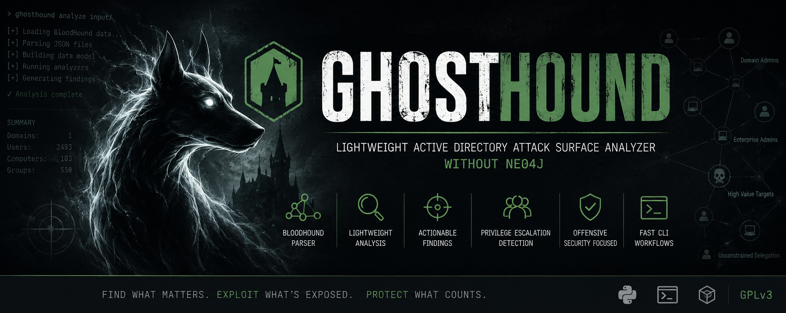
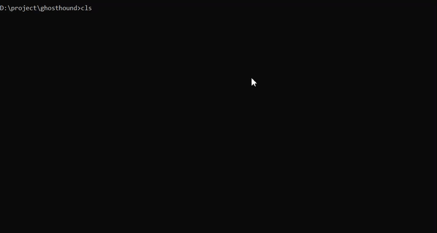

# 👻 GhostHound

> Lightweight Active Directory attack surface analyzer without Neo4j.

<p align="center">
  
</p>

<p align="center">
  
</p>

---

## ⚡ TL;DR

GhostHound transforms BloodHound data into **actionable security findings** in seconds — focusing on real attack surfaces, not graphs.

> BloodHound shows relationships.  
> GhostHound shows risk.

---

## 🚨 Problem

Traditional Active Directory analysis tools:

- Require Neo4j setup
- Produce complex graph visualizations
- Require manual attack path analysis
- Are slow for quick security assessments

👉 Result: too much data, not enough action.

---

## 💡 Solution

GhostHound extracts only what matters:

- 🔥 Exploitable misconfigurations
- 🔑 Credential attack vectors
- 🧭 Privilege escalation paths
- ⚠️ High-risk AD exposures

All in a **fast CLI workflow**.

---

## ⚡ Example Output

```text
[CRITICAL] 3 Domain Admin Members
- ADMINISTRATOR@OFFSEC.NL
- CLARENCE_WILSON@OFFSEC.NL
- DON_ROBERTS@OFFSEC.NL

[HIGH] 165 AS-REP Roastable Users

[HIGH] 50 Kerberoastable Users
```

---

## 🧠 Key Features

- BloodHound ZIP/JSON parsing
- Normalized AD object model
- Kerberoast detection
- AS-REP roast detection
- Domain Admin analysis
- Lightweight CLI output
- Modular analyzer system

---

## 🧠 Why GhostHound?

GhostHound is built for speed and clarity:

- ⚡ Fast analysis
- 🎯 Actionable output
- 🧩 Modular architecture
- 🪶 Lightweight (no Neo4j)

---

## 🏗 Architecture

```text
BloodHound Data
        ↓
     Parsers
        ↓
Normalized Models
        ↓
    Analyzers
        ↓
     Findings
        ↓
     CLI Output
```

---

## 🎯 Use Cases

- Red team reconnaissance
- Active Directory security audits
- Internal pentesting
- Attack surface review
- Pre-engagement analysis

---

## ⚠️ Not a Replacement For

GhostHound is NOT:

- ❌ BloodHound replacement
- ❌ Graph visualization tool
- ❌ Full attack simulation framework

---

## 🚀 Roadmap

### v0.1 (Current)
- BloodHound parser
- Basic analyzers
- CLI reporting

### v0.2
- NetExec integration
- Correlation engine
- Attack path linking

### v0.3
- Risk scoring system
- Session analysis
- Lateral movement mapping

---

## 📦 Installation

```bash
git clone https://github.com/oko-ops/ghosthound
cd ghosthound
pip install -e .
```

---

## 🧪 Usage

```bash
ghosthound analyze input/
```

or

```bash
ghosthound analyze input/bloodhound.zip
```

---

## 🤝 Contributing

PRs welcome:

- New analyzers
- Correlation logic
- Data parsers
- Reporting improvements

---

## 📄 License

GPLv3 © 2026 oko-ops
